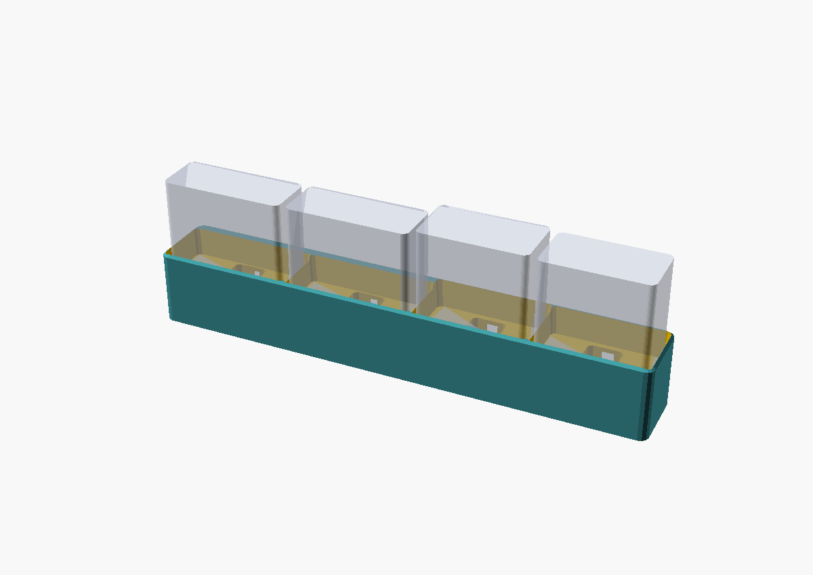

# earbud-dock — 4-bay Galaxy Buds charging dock

A clean, low-profile desk dock that charges four Samsung Galaxy Buds cases at
once. Each bay routes a **right-angle USB-C cable up through the base** so the
connector stands proud of the floor; you lower the case straight down onto it.
Thin walls separate the bays, and a **fillable weight well** keeps the dock
planted when you lift a case off.

## Bays (left → right)

| Bay | Case | Port-face footprint W×D (mm) | Stand height (mm) |
|-----|------|------------------------------|-------------------|
| 1 | Galaxy Buds 3 | 58.9 × 24.4 | 48.7 |
| 2 | Galaxy Buds 3 Pro | 58.9 × 24.4 | 48.7 |
| 3 | Galaxy Buds 4 Pro | 51.0 × 28.3 | 51.0 |
| 4 | Galaxy Buds Live | 50.2 × 27.8 | 50.0 |

Each pocket is the case footprint **+0.6 mm clearance per side** (slip fit) with
a 1.2 mm lead-in chamfer at the mouth. Pockets are **front-aligned**: every bay
shares one flush front face, and the depth difference between cases is taken up
by a thicker (hidden) back wall, so shallower cases still fit snugly front-to-back.

**Overall: 234.8 × 34.5 × 35 mm.** Bodies print watertight/manifold.

## How the cases sit — the one design decision to know

To drop a case straight down onto an upward-pointing plug, the case must be
seated **port-face down**. The USB-C port is in a different place per case:

- **Buds 3 / Buds 3 Pro** — port on the *bottom* → case stands upright (its
  natural pill orientation), port centered underneath.
- **Buds 4 Pro / Buds Live** — port on the *back* → the case stands on its back
  edge so that port faces down onto the plug.

The plug is positioned at the **center** of each footprint. Galaxy ports are
roughly centered, so this works as-is; if your specific cable/case needs the
plug nudged, adjust per bay in `dock.scad` (the `pocket_void` connector
position). If you'd rather lay the square cases (4 Pro / Live) flat instead of
on edge, tell me and I'll re-cut those two bays.

## Keeping it from lifting (read this)

Plain PLA at this size is ~130–170 g — **not** enough to beat USB-C plug
retention on a hard straight-up pull. Three things work together:

1. **Long anti-tip footprint** (235 mm) — the natural way to remove a case is a
   slight tilt/rock, which peels the connector at low force while the long base
   resists tipping.
2. **Strain-relieved cable** — the 6 mm rear channel grips the cable so a pull
   tends to release the *plug from the case*, not lift the dock.
3. **Fillable weight well** — open the bottom, pour in ballast, snap on the
   printed cover (`part="cover"`). Capacity ≈ **43 cm³**:

   | Fill | Added mass |
   |------|-----------|
   | Dry sand | ~70 g |
   | Steel BBs / shot | ~195 g |
   | Lead shot | ~290 g |

For a guaranteed no-lift even under a careless vertical yank, use steel/lead
ballast **and** stick-on rubber/VHB feet (recesses provided at the four corners)
to bond the dock to the desk. Also seat each plug only as deep as charging needs
— less insertion = less extraction force.

## Files

- `dock.scad` — parametric source. `part = "dock" | "cover" | "all"`.
- `mockup.scad` — dock with ghost cases, for fit/scale checks (not for print).
- `stl/earbud-dock.stl` — the dock body.
- `stl/earbud-dock-cover.stl` — the weight-well cover.
- `renders/` — iso, front, section, underside, and the mockup shown above.

## Printing

- **Material:** PLA or PETG. **Walls:** dividers are 2.0 mm (5 perimeters at
  0.4 mm nozzle), outer 2.5 mm.
- **Orientation:** print the dock as modeled (pockets up). The weight-well
  ceiling self-bridges (~24 mm spans); no supports needed.
- **Infill:** 4+ perimeters, 25–40 % infill. The well provides the real mass, so
  you don't need to print solid.
- **Cover:** prints flat, friction-fits up into the recess against an internal
  ledge. Bump `cover_gap` if it's tight, or add a dab of glue once filled.

## Assembly

1. Print the dock and cover.
2. From the bottom, thread each right-angle USB-C cable into a bay's elbow cavity
   so the connector pokes up through the floor; the cable exits the back channel.
3. Seat the cables, pour ballast into the well, press the cover home.
4. Stick rubber feet in the corner recesses. Plug in, drop your cases on.

## Sources (case dimensions)

- Galaxy Buds Live (SM-R180): 50.2 × 50.0 × 27.8 mm —
  [Samsung Business support](https://www.samsung.com/us/business/support/owners/product/galaxy-buds-live/)
- Galaxy Buds 3 / Buds 3 Pro case: 58.9 × 48.7 × 24.4 mm —
  [Three device support](https://devicesupport.three.co.uk/guides/device/Samsung/GalaxyBuds3Pro),
  [Samsung US](https://www.samsung.com/us/mobile-accessories/buds/galaxy-buds3-pro-charging-case-sku-ep-qr630cjegus/)
- Galaxy Buds 4 Pro case: 51.0 × 51.0 × 28.3 mm, USB-C on the back —
  [GSMArena review](https://www.gsmarena.com/samsung_galaxy_buds4_pro_review-news-72379.php)
