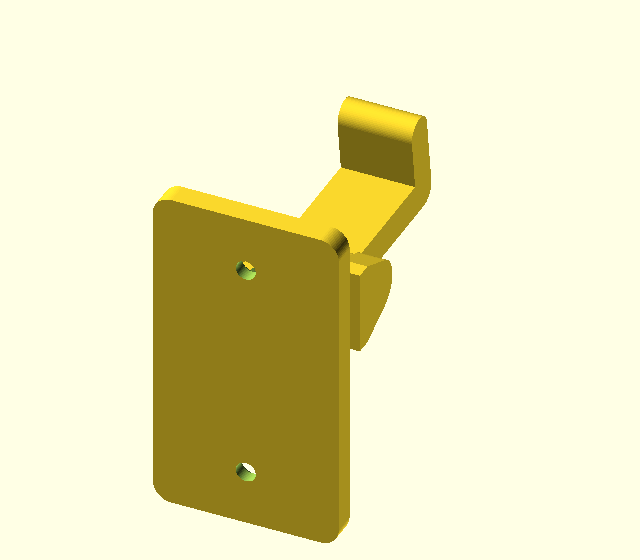

# Folding Wall Hook



A parametric, snap-fit folding wall hook, designed and validated entirely with
[Demiourgos](../../README.md).

This is an **independent reimplementation of the concept** from VC Design's
["Folding Wall Hook"](https://www.printables.com/model/1616074-folding-wall-hook)
on Printables — a wall hook that folds flat against the wall when not in use and
swings out to hang things. No original geometry or STL was copied; the design
here was modelled from scratch in OpenSCAD to recreate the *mechanism* (a
clevis + pivoting arm on snap-fit trunnion pins).

## Parts

Three printed parts, no fasteners for the joints — two snap-fit axes of motion:

| Part | Role |
|------|------|
| **base** | Wall plate with two countersunk M4 holes and a vertical **post** (gusseted) with a snap head. |
| **body** | A collar that snaps onto the post and **rotates** about it (vertical axis), carrying the clevis. |
| **hook** | An arm whose trunnion pins snap into the body's clevis and **tilt** (horizontal axis): folds flat, swings out to a load stop. |

So the hook both **swivels** sideways (body on post) and **folds** up/down (arm in
body). The body's collar has a slotted retaining lip that flexes over the post's
head during assembly, then rotates freely and rests on the gusset.

## Dimensions (defaults)

- Plate: 40 × 72 × 5 mm, two M4 countersunk holes.
- Swivel post: 9 mm shaft, ~12 mm snap head.
- Hinge: 5 mm trunnion pins; arm 16 mm wide; ~34 mm reach.

All dimensions are parameters at the top of `folding-wall-hook.scad` (rendered as
a Customizer panel in the OpenSCAD GUI).

## Clearances

The joints use slip fits: **0.25 mm per-side** pin/socket clearance, **0.3 mm**
between the arm and the ears, and **0.4 mm** on the swivel collar. If your
printer/material runs tight or loose, calibrate once with Demiourgos and adjust:

```
recommend_clearance  printer=<p> material=<m> fit_class=slip
```

then set `pin_clear` / `joint_clear` / `shaft_clear` to the recommended value. A
ready-made fit-test coupon for the 5 mm pin is checked in as
`pin-fit-coupon.scad` (generated by Demiourgos `gen_fit_coupon`): print it, find
the tightest hole the pin slips into, and feed that back with `record_outcome`.

Ready-to-slice STLs are checked in under [`stl/`](stl/) (`base.stl`, `body.stl`,
`hook.stl`), each pre-oriented for printing. To regenerate, set `part` to
`"base"`, `"body"`, or `"hook"` and export.

- Suggested: 0.2 mm layers, 3 walls, ≥ 30% infill (the hook arm carries load).
- PLA or PETG both work; PETG is tougher for a load-bearing hook.
- DFM (Demiourgos `dfm_check`): the only flags are small internal bridges (hole
  tops, the lip-to-chamber step) that print fine; no thin walls.

## Assembly

1. Print **base**, **body**, and **hook**.
2. Snap the hook's trunnion pins into the body's clevis.
3. Push the body's collar down onto the post until the lip clicks past the head;
   it now swivels freely.
4. Mount the base to the wall with two M4 screws (countersunk heads sit flush).

## How it was built

Authored in OpenSCAD and iterated with Demiourgos: `compile_check` (fast
validation), `render` (named-view contact sheets — the renders in this repo were
produced this way), `measure` (envelope/volume), `dfm_check` (overhang/wall
pre-flight), and `recommend_clearance` (snap-fit clearances). See the repo root
for the toolchain.

## License

Same dual MIT/Apache-2.0 license as the parent project. The original concept is
by VC Design; this is a clean-room parametric reimplementation.
