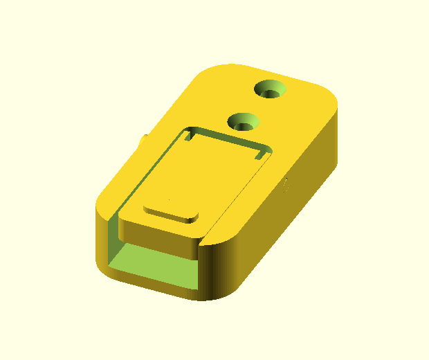
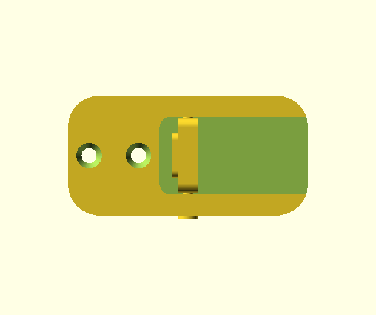

# Squared-Oval Folding Wall Hook



Folded flush (above) and deployed as a peg (below):



> **Spin it in 3D:** open [`folding-wall-hook-viewer.html`](folding-wall-hook-viewer.html)
> in a browser to orbit/zoom the actual mesh — works fully offline (Three.js is
> inlined; generated by Demiourgos `view_3d`).

An **original** parametric flush-folding wall hook, designed and validated
entirely with [Demiourgos](../../README.md).

A flat **paddle** nests flush in a front pocket of a wall-mounted **frame** when
not in use, and swings out the bottom to become a peg you hang things on. The
styling is a **squared oval** (rounded rectangle) — its own look and its own
geometry.

## Not a copy

This is independent work, not derived from any specific third-party model. It was
*inspired by the general idea* of flush-folding hooks (a common functional
pattern), but the shape, proportions, two-part construction, and pivot mechanism
here are this project's own. The Printables model that prompted the idea is
licensed in a way that does not permit derivatives, so nothing from it is used or
redistributed — this is a deliberately different, original design.

## Parts

Three printed parts: a frame, a paddle, and one 3 mm axle. **No loose lock pin** —
the deploy angle is held by a built-in detent.

| Part | Role |
|------|------|
| **frame** | Squared-oval wall plate with two countersunk M4 holes, a front pocket, a pivot bore, and two detent dimples in the pocket walls. |
| **paddle** | A squared-oval tongue with a pivot bore and two flexible detent fingers (each with a ball); folds flush, swings out to hang things. |
| **axle** | A 3 mm headed pin (or a 3 mm rod / filament / paperclip) the paddle rotates on. |

Folded, the paddle sits flush; flip it out (there's a finger-lip) and it **clicks
into a detent** at horizontal — push past the click to fold it away. No second
pin to insert or lose.

**Why a detent (and a separate axle)?** Two findings drove the design:
1. Integral snap-in pins can't be inserted into the rigid pocket (the walls won't
   flex the ~3 mm needed) — so the pivot is a **separate axle**: drop the paddle
   in, push the axle through.
2. A single-pivot flush hook **can't hold a downward load with a simple stop** —
   the load torque rotates the paddle back toward folded, the same direction it
   must be free to fold, so any rigid stop also blocks folding. The escape used
   here is a **compliant over-center detent**: two thin sprung fingers on the hub
   carry balls that snap into dimples in the pocket walls at the deploy angle.

Both are written up in the repo's
[design knowledge](../../docs/support-free-design.md#design-for-assembly--printed-hinges-and-pivots).

> Trade-off vs. a lock pin: a printed ball detent is a **soft hold** (it resists
> casual folding and light loads and clicks positively), not a rigid lock. For
> heavier loads, increase `nub_press` / reduce `finger_w`, or switch back to a
> drop-in lock pin.

## Dimensions (defaults)

- Frame: **34 × 68 × 15 mm**, two M4 countersunk holes. (The 15 mm depth gives the
  detent hub room to clear the pocket back wall as it swings.)
- Paddle: ~31 × 44 mm, 6 mm thick.
- Axle: 3 mm shaft, 6 mm head.
- Detent angle: **90°** (horizontal peg); set by `detent_angle`.

Everything is a parameter at the top of `folding-wall-hook.scad` (a Customizer
panel) — including `corner`, `detent_angle`, `nub_press` (snap firmness), and
`finger_w` (finger stiffness).

## Clearances & detent

Sized for a 3 mm axle: **0.3 mm per-side** in the paddle (free rotation), **0.05 mm
per-side** in the frame (friction hold), and **0.4 mm per-side** paddle-to-pocket.
The detent ball passes the pocket wall by **`nub_press` = 0.3 mm** (the squeeze)
and seats in a dimple `nub_r + 0.1` mm wide. If your printer/material runs tight
or loose, calibrate the axle once:

```
recommend_clearance  printer=<p> material=<m> fit_class=slip
```

then set `axle_clear` / `axle_fit` / `paddle_clear`. A fit-test coupon
(`pin-fit-coupon.scad`) is checked in; print it, find the tightest hole the axle
slips into, and `record_outcome`.

## Printing — support-free

All three parts print **without supports** in their built-in orientations (verified
with Demiourgos `dfm_check` + an `interference` sweep that confirms the paddle
clears the frame across the 0–120° swing and the detent seats at 90°). Ready-to-slice
STLs are in [`stl/`](stl/) (`frame.stl`, `paddle.stl`, `axle.stl`). To regenerate,
set `part` and export.

- Suggested: 0.2 mm layers, 3 walls, ≥ 25% infill (more for a load-bearing paddle).
- PLA or PETG both work; PETG is tougher and springier for the detent fingers.

The support-free design moves (see
[`docs/support-free-design.md`](../../docs/support-free-design.md)):

- The **paddle prints flat on its broad face**, so the rounded edges become
  vertical walls and the part gets a big bed footprint.
- The axle **bore is teardropped** (`use <demiourgos_support.scad>`) — round
  bearing, self-supporting ceiling.
- The **axle prints standing on its head** (flat disc on the bed, shaft up).

The only remaining `dfm_check` flag is a ~0.45 mm feather at the teardrop apex (a
hole-ceiling feature, not a structural wall) — it prints fine.

## Assembly

1. Print **frame**, **paddle**, and **axle** (or use a 3 mm rod / filament /
   paperclip in place of the printed axle).
2. Drop the paddle into the frame's pocket and line up the pivot bores.
3. Push the **axle** through frame → paddle → frame until its head seats.
4. Mount the frame to the wall with two M4 screws (countersunk heads sit flush).

**To use:** flip the paddle out — it clicks into the detent at horizontal and holds
there. Push past the click to fold it back flush.

The axle fit, the pocket clearance, and especially the **detent snap force** are
calibrated-printer assumptions — verify them with the short
[print-test note](PRINT-TEST.md) before trusting them, and `record_outcome` so the
engine learns your real numbers.

## How it was built

Authored in OpenSCAD and iterated with Demiourgos: `compile_check`, `render`
(the contact sheets/hero image), `measure` (envelope/volume), `dfm_check`
(overhang/wall pre-flight — it caught a thin pivot-socket wall mid-design), and
`recommend_clearance`. See the repo root for the toolchain.

## License

Dual MIT/Apache-2.0, same as the parent project — this is original work, free to
use and modify.
