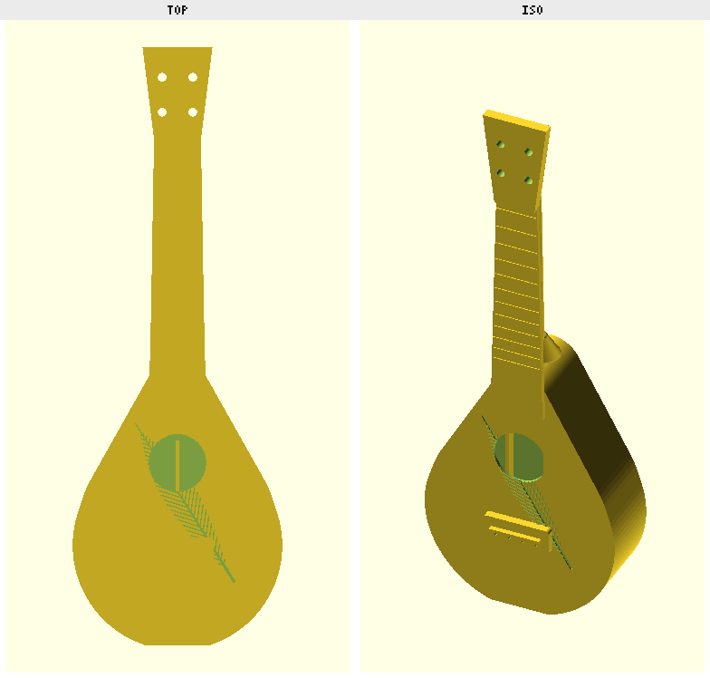

# Teardrop Lute-Ukulele

A soprano ukulele with a teardrop "lute" body and a normal uke neck — a clean-room
parametric OpenSCAD design (no third-party geometry). Two printed pieces (body + neck)
that slide together at a tenon/mortise joint.

## Parts

| File | Part |
|------|------|
| `td_body.scad` / `stl/td_body.stl` | Hollow teardrop soundbox: soundhole, bridge w/ saddle + 4 tie-holes, longitudinal back braces, neck mortise, engraved feather, flat tail base |
| `td_neck.scad` / `stl/td_neck.stl` | Tapered fretboard w/ computed frets, nut, round back, rounded heel, headstock (4 tuners), mating tenon |
| `td_dims.scad` | **Shared parameters** — edit here to change scale, body shape, action, etc. |
| `td_assembly.scad` | Both parts placed together (for rendering only) |

## Specs

- **Soprano**, 330.7 mm (13") scale; 12 frets, equal temperament
- Nut width 35.6 mm; string action **0.5 mm @ 1st fret, 2.5 mm @ 12th**
- Body 232 × 168 × 60 mm, ~2.6 mm walls; bridge 4-string @ 12 mm spacing
- Joint: rectangular tenon + mortise, **0.2 mm/side slip clearance** (Prusa XL / PLA default —
  the neck tenon carries the clearance, so the body prints as-is). Should slide together without
  sanding; glue to lock.

To re-generate STLs after editing: open in OpenSCAD and export, or
`prusa-slicer -g ...` / the demiourgos `export` tool.

## Printing

**Both parts print VERTICALLY** (the STLs are already oriented — just drop to bed).
No supports are required: the body's internal cavity closes with a self-supporting gable roof,
the back braces run straight up, and the headstock fuses into the neck (no empty layers).

Tested on **Prusa XL (0.4 nozzle), Generic PLA, 0.20 mm STRUCTURAL**:

| Part | Time | Filament |
|------|------|----------|
| Neck | ~4h 40m | ~75 g |
| Body | ~12h 40m | ~261 g |

### Required slicer settings

1. **Brim — ON, ~8 mm.** Critical. The neck is a 287 mm tower standing on a small
   (~46 × 5 mm) fretboard-tip footprint; it will tip/peel without a brim. The body's flat base
   also benefits.
2. **Supports → "On build plate only."** The body is a sealed soundbox — this guarantees the
   slicer can never drop supports *inside* the cavity, where they'd be trapped. (None are needed
   at default thresholds, but keep this as a safety.)
3. **Cooling — part/bridge fan 100%.** External overhangs (lower body flare, bridge underside,
   soundhole top) all print on bridging; PLA needs the airflow.

### Recommended

4. **Ensure-vertical-shell-thickness / enough perimeters** so the 2.6 mm walls print **airtight**
   (a leaky soundbox loses projection).
5. **Detect bridging perimeters: on**; **seam position: rear** (keeps the soundboard face clean).
6. 0.20 mm layer height and 15 % infill are fine as-is.

### Lighter body (optional)

261 g is on the heavy side — it's mostly the airtight 2.6 mm walls. For a lighter, more resonant
body, reduce `wall_th` to ~2.0 mm in `td_dims.scad` (re-export), or drop infill to ~10 %.

## Assembly

Slide the neck tenon into the body mortise (it laps the fretboard extension over the soundboard).
The 0.2 mm clearance is sized for a sand-free slip fit on a Prusa XL in PLA — verify with a fit
coupon and recalibrate if your printer/filament runs tighter or looser.
